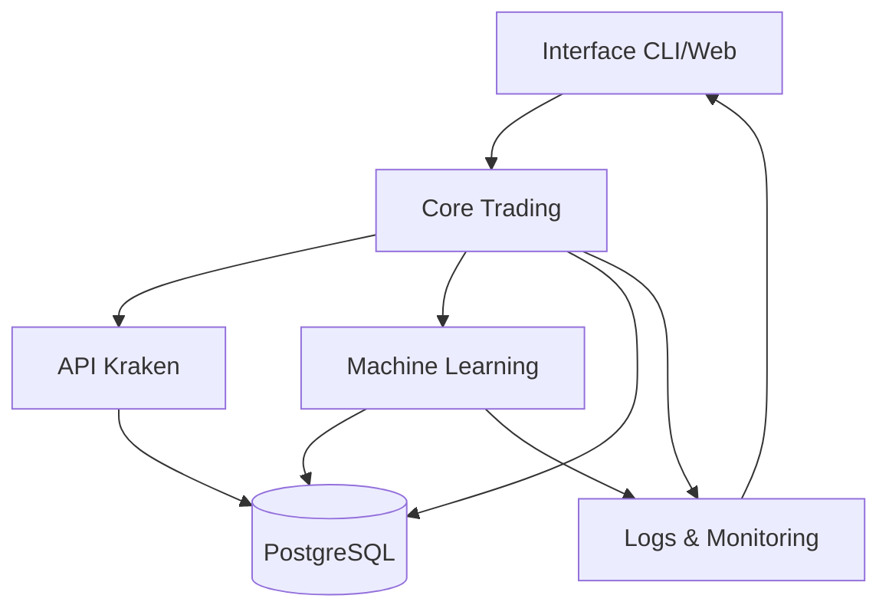

# Kraken Trading Bot 🤖

[](https://www.python.org/)
[](https://opensource.org/licenses/MIT)
[](https://github.com/psf/black)

---

## 📋 Présentation
Kraken_Bot est une plateforme de trading algorithmique avancée pour la bourse Kraken, intégrant des stratégies de trading sophistiquées, de l'apprentissage automatique, une gestion avancée des risques et un monitoring complet. 

- **Objectif** : Automatiser le trading sur Kraken avec des stratégies robustes, une gestion du risque professionnelle et des outils d’analyse avancés.
- **Public visé** : Traders, développeurs, chercheurs, passionnés de finance quantitative.

---

## 🏗️ Architecture du projet



- **src/** : Code principal (core, stratégies, gestion du risque, etc.)
- **db/** : Scripts et gestion de la base de données
- **ml_models/** : Modèles d’apprentissage automatique
- **logs/** : Logs détaillés et historiques
- **config/** : Fichiers de configuration YAML/JSON
- **tests/** : Tests unitaires et d’intégration

---

## 🚀 Fonctionnalités principales
- Stratégies multiples (momentum, mean reversion, breakout, grid, swing)
- Analyse technique avancée (RSI, MACD, ATR, SuperTrend, etc.)
- Prédiction ML (Random Forest, XGBoost, LSTM, etc.)
- Gestion dynamique du risque (stop-loss, take-profit, trailing, sizing)
- Backtesting et optimisation automatique
- Monitoring temps réel (dashboard, alertes, logs)
- Support Docker & CI/CD

---

## 🛠 Installation rapide

### Prérequis
- Python 3.12+
- Docker & Docker Compose (optionnel mais recommandé)
- Compte Kraken + clés API

### Installation
```bash
git clone https://github.com/votre-utilisateur/Kraken_Bot.git
cd Kraken_Bot
python -m venv venv
source venv/bin/activate
pip install -r requirements.txt
pip install -r requirements-dev.txt  # Pour le dev
```

### Configuration
```bash
cp config/config.example.yaml config/config.yaml
# Éditez config.yaml et .env selon vos besoins (API, paires, risque, etc.)
```

### Lancement
- **Mode local** :
  ```bash
  python -m src.main --config config/config.yaml
  ```
- **Avec Docker** :
  ```bash
  sudo docker-compose up --build
  ```

---

## 📂 Structure du projet

```
Kraken_Bot-main/
├── src/                # Code principal (core, stratégies, ML, utils)
├── db/                 # Scripts SQL, gestion PostgreSQL
├── ml_models/          # Modèles ML sauvegardés
├── config/             # Configurations YAML/JSON
├── logs/               # Logs détaillés
├── tests/              # Tests unitaires et intégration
├── scripts/            # Scripts utilitaires
├── Dockerfile          # Image Docker
├── docker-compose.yml  # Orchestration Docker
├── README.md           # Documentation principale
└── ...
```

---

## 🧑‍💻 Exemples d’utilisation avancée

### Lancer un backtest
```bash
python -m src.core.backtesting.backtester --config config/config.yaml --start-date 2024-01-01 --end-date 2024-12-31
```

### Lancer l’optimisation automatique
```bash
python -m src.core.ml.trainer --config config/config.yaml --optimize --timeout 3600
```

### Dashboard web (si activé)
```bash
python -m src.dashboard
# Accès : http://localhost:8050
```

### Monitoring & logs
- Fichiers dans `logs/` (trading, erreurs, performance)
- Alertes Telegram/Email (si configuré)

---

## ⚙️ Configuration détaillée
- **config/config.yaml** : Paramètres de trading, paires, timeframe, gestion du risque, stratégies activées, etc.
- **.env** : Clés API Kraken, variables sensibles
- **config.json** : Paramètres avancés (optionnel)

---

## 🛡️ Gestion des risques
- Stop-loss dynamique (ATR, volatilité)
- Sizing intelligent (volatilité, performance, corrélation)
- Circuit breaker (drawdown, pertes consécutives, erreurs API)
- Limites de position, trailing stop, take-profit adaptatif

---

## 🤖 Stratégies intégrées
- **Momentum** : RSI, MACD, volume
- **Mean Reversion** : Bollinger, RSI
- **Breakout** : Support/résistance, volume
- **Grid** : Grille dynamique
- **Swing** : Détection de retournements

---

## 🧠 Machine Learning
- Prédiction directionnelle (classification)
- Estimation de volatilité
- Détection d’anomalies
- Modèles : Random Forest, XGBoost, LSTM, stacking

---

## 🧪 Tests & Qualité
- Tests unitaires : `pytest tests/unit -v`
- Tests d’intégration : `pytest tests/integration -v`
- Couverture : `pytest --cov=src --cov-report=html`
- Contrôles qualité : `pre-commit run --all-files` ou `./scripts/check_quality.sh`
- Outils : Black, isort, Flake8, Mypy, Pylint

---

## 🛠️ Développement & Contribution
- Fork, branche, PR, review (voir CONTRIBUTING.md)
- Respecter le style de code (Black, isort, Flake8, Mypy)
- Ajouter des tests pour chaque nouvelle fonctionnalité
- Documenter chaque module/fonction
- Utiliser les issues pour discuter des bugs/évolutions

---

## 📈 Roadmap (extraits)
- [x] Dockerisation complète
- [x] Backtesting multi-stratégies
- [x] Intégration ML (XGBoost, LSTM)
- [ ] Dashboard web interactif
- [ ] API REST pour pilotage externe
- [ ] Stratégies supplémentaires (arbitrage, market making)
- [ ] Support multi-bourses

---

## ❓ FAQ
- **Erreur Docker ?** → Vérifiez la version de Docker Compose et les permissions.
- **Connexion API échouée ?** → Vérifiez vos clés dans `.env` et la config réseau.
- **Problème de dépendances ?** → `pip install -r requirements.txt` puis `pip install -r requirements-dev.txt`
- **Logs vides ?** → Vérifiez les droits d’écriture sur le dossier `logs/`.
- **Tests qui échouent ?** → Lancez `pytest` en local, vérifiez la config.

---

## 📜 Licence
Distribué sous licence MIT. Voir [LICENSE](LICENSE) pour plus d’informations.

---

## 👥 Contacts & Support
- **Auteur principal** : Sélim Marouani ([GitHub](https://github.com/votrecompte))
- **Contact** : votre.email@example.com
- **Issues** : [https://github.com/votrecompte/kraken-trading-bot/issues](https://github.com/votrecompte/kraken-trading-bot/issues)
- **Contribuer** : voir [CONTRIBUTING.md](CONTRIBUTING.md)

---

## 🙏 Remerciements & Inspirations
- Kraken API, Pandas, SQLAlchemy, Pytest, Docker, XGBoost, LSTM, et toute la communauté open source.

---

*Dernière mise à jour : 16 juillet 2024*
