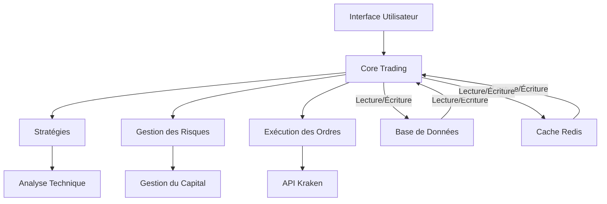
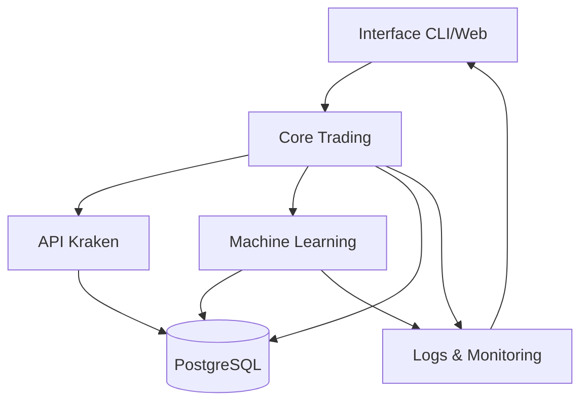

# 🤖 Kraken Trading Bot

[](https://www.python.org/)
[](https://opensource.org/licenses/MIT)
[](https://github.com/psf/black)
[](https://github.com/yourusername/Kraken_Bot/tree/main/docs)
[](https://github.com/yourusername/Kraken_Bot)
[](CONTRIBUTING.md)
[](https://github.com/yourusername/Kraken_Bot/pulls)

## 📋 Présentation

Kraken_Bot est une plateforme de trading algorithmique avancée pour la bourse Kraken. Développée en Python, elle intègre des stratégies de trading sophistiquées, de l'apprentissage automatique, une gestion avancée des risques et un monitoring complet.

### 🎯 Fonctionnalités Clés

- 🚀 **Trading Automatique** sur la plateforme Kraken
- 📊 **Stratégies Intégrées** : Momentum, Mean Reversion, Breakout, etc.
- 🛡️ **Gestion des Risques** avancée avec stop-loss dynamique
- 🤖 **Machine Learning** pour l'analyse prédictive
- 📈 **Backtesting** intégré pour valider les stratégies
- 📱 **Interface en Ligne de Commande** intuitive
- 🧠 **Architecture Modulaire** et facilement extensible
- 📊 **Tableaux de Bord** pour le suivi des performances

### 🏗️ Architecture Technique



## 🚀 Démarrage Rapide

### Prérequis

- Python 3.12+
- PostgreSQL
- Redis
- Compte Kraken avec clés API

### Installation

1. **Cloner le dépôt** :
   ```bash
   git clone https://github.com/yourusername/Kraken_Bot.git
   cd Kraken_Bot
   ```

2. **Configurer l'environnement** :
   ```bash
   python -m venv venv
   source venv/bin/activate  # Linux/Mac
   # OU
   .\venv\Scripts\activate  # Windows
   
   pip install -r requirements.txt
   ```

3. **Configurer les variables d'environnement** :
   ```bash
   cp .env.example .env
   # Éditez .env avec vos paramètres
   ```

4. **Initialiser la base de données** :
   ```bash
   python scripts/init_db.py
   ```

5. **Lancer le bot** :
   ```bash
   python main.py
   ```

## 📚 Documentation Complète

Consultez la [documentation complète](docs/README.md) pour plus de détails sur :

- [Guide d'installation](docs/getting_started/installation.md)
- [Configuration de l'API Kraken](docs/getting_started/api_authentication.md)
- [Guide des stratégies](docs/user_guide/strategies.md)
- [Gestion des risques](docs/user_guide/risk_management.md)
- [Développement de stratégies personnalisées](docs/developer_guide/creating_strategies.md)
- [FAQ](docs/faq.md)

## 🤝 Contribution

Les contributions sont les bienvenues ! Consultez notre [guide de contribution](CONTRIBUTING.md) pour commencer.

## 📄 Licence

Ce projet est sous licence MIT. Voir le fichier [LICENSE](LICENSE) pour plus de détails.

## 📞 Support

Pour toute question ou problème, veuillez [ouvrir une issue](https://github.com/yourusername/Kraken_Bot/issues).

## 📊 Aperçu

### Interface en Ligne de Commande
```
====================================
  KRAKEN BOT - TRADING TERMINAL
====================================

💰 Portefeuille: 10,000.00 EUR
📈 Performance: +15.3% (30j)
🔄 Trades actifs: 5/10

[1] Démarrer le trading
[2] Configurer les stratégies
[3] Afficher le portefeuille
[4] Voir les performances
[5] Paramètres
[6] Quitter

Votre choix: 
```

### Statistiques de Performance
```
📊 PERFORMANCE GLOBALE
-----------------------
Capital initial: 10,000.00 EUR
Capital actuel: 11,530.00 EUR
Rendement total: +15.30%

📈 MEILLEURS TRADES
-------------------
1. BTC/EUR: +24.5%
2. ETH/EUR: +18.2%
3. SOL/EUR: +12.7%

📉 PIRE TRADES
--------------
1. XRP/EUR: -5.2%
2. ADA/EUR: -3.1%
3. DOGE/EUR: -1.8%
```

## 📅 Roadmap

- [ ] Interface Web
- [ ] Support pour d'autres exchanges
- [ ] Stratégies avancées avec ML
- [ ] Optimisation des performances
- [ ] Backtesting distribué

## 📞 Contact

Pour toute question ou suggestion, n'hésitez pas à [nous contacter](mailto:contact@example.com).

---

## 🏗️ Architecture du projet



- **src/** : Code principal (core, stratégies, gestion du risque, etc.)
- **db/** : Scripts et gestion de la base de données
- **ml_models/** : Modèles d’apprentissage automatique
- **logs/** : Logs détaillés et historiques
- **config/** : Fichiers de configuration YAML/JSON
- **tests/** : Tests unitaires et d’intégration

---

## 🚀 Fonctionnalités principales
- Stratégies multiples (momentum, mean reversion, breakout, grid, swing)
- Analyse technique avancée (RSI, MACD, ATR, SuperTrend, etc.)
- Prédiction ML (Random Forest, XGBoost, LSTM, etc.)
- Gestion dynamique du risque (stop-loss, take-profit, trailing, sizing)
- Backtesting et optimisation automatique
- Monitoring temps réel (dashboard, alertes, logs)
- Support Docker & CI/CD

---

## 🛠 Installation rapide

### Prérequis
- Python 3.12+
- Docker & Docker Compose (optionnel mais recommandé)
- Compte Kraken + clés API

### Installation
```bash
git clone https://github.com/votre-utilisateur/Kraken_Bot.git
cd Kraken_Bot
python -m venv venv
source venv/bin/activate
pip install -r requirements.txt
pip install -r requirements-dev.txt  # Pour le dev
```

### Configuration
```bash
cp config/config.example.yaml config/config.yaml
# Éditez config.yaml et .env selon vos besoins (API, paires, risque, etc.)
```

### Lancement
- **Mode local** :
  ```bash
  python -m src.main --config config/config.yaml
  ```
- **Avec Docker** :
  ```bash
  sudo docker-compose up --build
  ```

---

## 📂 Structure du projet

```
Kraken_Bot-main/
├── src/                # Code principal (core, stratégies, ML, utils)
├── db/                 # Scripts SQL, gestion PostgreSQL
├── ml_models/          # Modèles ML sauvegardés
├── config/             # Configurations YAML/JSON
├── logs/               # Logs détaillés
├── tests/              # Tests unitaires et intégration
├── scripts/            # Scripts utilitaires
├── Dockerfile          # Image Docker
├── docker-compose.yml  # Orchestration Docker
├── README.md           # Documentation principale
└── ...
```

---

## 🧑‍💻 Exemples d’utilisation avancée

### Lancer un backtest
```bash
python -m src.core.backtesting.backtester --config config/config.yaml --start-date 2024-01-01 --end-date 2024-12-31
```

### Lancer l’optimisation automatique
```bash
python -m src.core.ml.trainer --config config/config.yaml --optimize --timeout 3600
```

### Dashboard web (si activé)
```bash
python -m src.dashboard
# Accès : http://localhost:8050
```

### Monitoring & logs
- Fichiers dans `logs/` (trading, erreurs, performance)
- Alertes Telegram/Email (si configuré)

---

## ⚙️ Configuration détaillée
- **config/config.yaml** : Paramètres de trading, paires, timeframe, gestion du risque, stratégies activées, etc.
- **.env** : Clés API Kraken, variables sensibles
- **config.json** : Paramètres avancés (optionnel)

---

## 🛡️ Gestion des risques
- Stop-loss dynamique (ATR, volatilité)
- Sizing intelligent (volatilité, performance, corrélation)
- Circuit breaker (drawdown, pertes consécutives, erreurs API)
- Limites de position, trailing stop, take-profit adaptatif

---

## 🤖 Stratégies intégrées
- **Momentum** : RSI, MACD, volume
- **Mean Reversion** : Bollinger, RSI
- **Breakout** : Support/résistance, volume
- **Grid** : Grille dynamique
- **Swing** : Détection de retournements

---

## 🧠 Machine Learning
- Prédiction directionnelle (classification)
- Estimation de volatilité
- Détection d’anomalies
- Modèles : Random Forest, XGBoost, LSTM, stacking

---

## 🧪 Tests & Qualité
- Tests unitaires : `pytest tests/unit -v`
- Tests d’intégration : `pytest tests/integration -v`
- Couverture : `pytest --cov=src --cov-report=html`
- Contrôles qualité : `pre-commit run --all-files` ou `./scripts/check_quality.sh`
- Outils : Black, isort, Flake8, Mypy, Pylint

---

## 🛠️ Développement & Contribution
- Fork, branche, PR, review (voir CONTRIBUTING.md)
- Respecter le style de code (Black, isort, Flake8, Mypy)
- Ajouter des tests pour chaque nouvelle fonctionnalité
- Documenter chaque module/fonction
- Utiliser les issues pour discuter des bugs/évolutions

---

## 📈 Roadmap (extraits)
- [x] Dockerisation complète
- [x] Backtesting multi-stratégies
- [x] Intégration ML (XGBoost, LSTM)
- [ ] Dashboard web interactif
- [ ] API REST pour pilotage externe
- [ ] Stratégies supplémentaires (arbitrage, market making)
- [ ] Support multi-bourses

---

## ❓ FAQ
- **Erreur Docker ?** → Vérifiez la version de Docker Compose et les permissions.
- **Connexion API échouée ?** → Vérifiez vos clés dans `.env` et la config réseau.
- **Problème de dépendances ?** → `pip install -r requirements.txt` puis `pip install -r requirements-dev.txt`
- **Logs vides ?** → Vérifiez les droits d’écriture sur le dossier `logs/`.
- **Tests qui échouent ?** → Lancez `pytest` en local, vérifiez la config.

---

## 📜 Licence
Distribué sous licence MIT. Voir [LICENSE](LICENSE) pour plus d’informations.

---

## 👥 Contacts & Support
- **Auteur principal** : Sélim Marouani ([GitHub](https://github.com/votrecompte))
- **Contact** : votre.email@example.com
- **Issues** : [https://github.com/votrecompte/kraken-trading-bot/issues](https://github.com/votrecompte/kraken-trading-bot/issues)
- **Contribuer** : voir [CONTRIBUTING.md](CONTRIBUTING.md)

---

## 🙏 Remerciements & Inspirations
- Kraken API, Pandas, SQLAlchemy, Pytest, Docker, XGBoost, LSTM, et toute la communauté open source.

---

*Dernière mise à jour : 16 juillet 2024*
# Kraken_Bot
