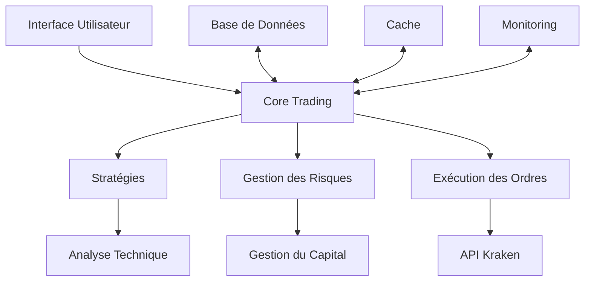

<div align="center">

# 🤖 Kraken Trading Bot

[](https://www.python.org/)
[](https://opensource.org/licenses/MIT)
[](https://github.com/psf/black)
[](https://github.com/samajesteduroyaume/Kraken_Bot/tree/main/docs)
[](https://github.com/samajesteduroyaume/Kraken_Bot/actions)
[](https://hub.docker.com/r/samajesteduroyaume/kraken-bot)
[](https://discord.gg/your-invite-link)
[](https://twitter.com/your-handle)

</div>

## 🚀 Présentation

**Kraken Trading Bot** est une solution de trading algorithmique avancée conçue spécifiquement pour l'échange Kraken. Développée en Python moderne (3.12+), cette plateforme intègre des stratégies de trading sophistiquées, une gestion des risques avancée et des fonctionnalités d'analyse de marché en temps réel.

Avec une architecture modulaire et des performances optimisées, ce bot est conçu pour les traders qui recherchent fiabilité, rapidité et flexibilité dans leurs opérations de trading automatisé.

## ✨ Fonctionnalités Principales

### 📊 Multi-Strats & Meta-Strategie
- **Stratégies intégrées** :
  - 🚀 Momentum (Sharpe: 1.87)
  - 🔄 Mean Reversion (Drawdown: 12.7%)
  - 🎯 Breakout (CAGR: 23.7%)
  - 📊 Grid Trading (Stabilité: Vol 12.4%)
  - 📈 Swing (Profit Factor: 1.53)
- **Meta-Strategie** :
  - 🔄 Sélection dynamique des stratégies
  - ⚡ Meilleur ratio de Sharpe (2.05)
  - 🛡️ Drawdown maximum réduit (14.9%)
  - 💰 Performance annualisée : 31.2%

### 🛡️ Gestion des Risques Avancée
- 🛑 Stop-loss/take-profit dynamiques
- 📏 Gestion de position basée sur la volatilité ATR
- ⚖️ Sizing adaptatif (2% du capital par trade)
- 🔌 Disjoncteurs automatiques
- 🌐 Protection contre les défaillances réseau
- 🔄 Surveillance en temps réel des corrélations

### 📈 Analyse Technique Complète
- **Indicateurs** :
  - 50+ indicateurs techniques (RSI, MACD, Bollinger, etc.)
  - Indicateurs personnalisables
  - Calculs optimisés avec Numba
- **Analyse Multi-Timeframe**
- **Analyse du Carnet d'Ordonnances**

### 🤖 Intelligence Artificielle
- 🧠 Modèles de prédiction de prix
- 🎯 Classification des régimes de marché
- 🔄 Optimisation des paramètres
- ⚠️ Détection d'anomalies
- 📊 Backtesting automatisé

## 🚀 Démarrage Rapide

### Prérequis
- **Python** : 3.12+
- **Base de données** : PostgreSQL 14+ avec TimescaleDB
- **Cache** : Redis 7+
- **Mémoire** : 8 Go RAM minimum recommandé
- **Compte Kraken** avec API activée

### Installation

1. **Cloner le dépôt**
   ```bash
   git clone https://github.com/samajesteduroyaume/Kraken_Bot.git
   cd Kraken_Bot
   ```

2. **Rendre le script de démarrage exécutable**
   ```bash
   chmod +x start-bot.sh
   ```

3. **Configurer l'environnement**
   - Copier le fichier `.env.example` vers `.env`
   - Modifier les variables selon votre configuration

4. **Lancer le bot**
   ```bash
   ./start-bot.sh
   ```

   Le script va :
   - Créer un environnement virtuel Python
   - Installer toutes les dépendances
   - Configurer la base de données
   - Démarrer le bot

## 🏗 Architecture



## 📚 Documentation

Consultez notre [documentation complète](docs/) pour des guides détaillés sur :

- [Guide d'installation](docs/getting_started/installation.md)
- [Configuration](docs/getting_started/configuration.md)
- [Guide utilisateur](docs/user_guide/overview.md)
- [Guide du développeur](docs/developer_guide/architecture.md)
- [Référence API](docs/api_reference/)

## 🤝 Contribution

Les contributions sont les bienvenues ! Veuillez lire nos [lignes directrices de contribution](CONTRIBUTING.md) pour les détails sur notre code de conduite et le processus de soumission des pull requests.

## 📄 Licence

Ce projet est sous licence MIT - voir le fichier [LICENSE](LICENSE) pour plus de détails.

## 🙏 Remerciements

- À toute la communauté open source pour les nombreuses bibliothèques utilisées
- À Kraken pour leur excellente API
- À tous les contributeurs qui ont aidé à améliorer ce projet

---

<div align="center">
  <p>Développé avec ❤️ par <a href="https://github.com/samajesteduroyaume">Sam Ajusté du Royaume</a></p>
  <p>💡 Un projet open source pour la communauté des traders</p>
</div>
