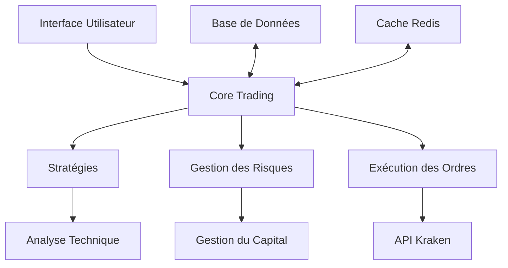
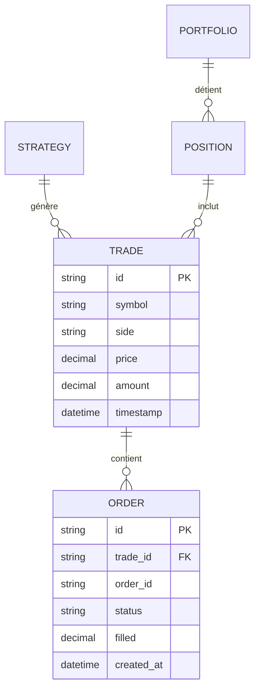

# 🏗️ Architecture du Projet

Ce document décrit l'architecture technique de Kraken_Bot, son organisation et ses principaux composants.

## Vue d'Ensemble

Kraken_Bot suit une architecture modulaire organisée autour des principaux composants suivants :



## Structure des Répertoires

```
Kraken_Bot/
├── config/                 # Fichiers de configuration
├── db/                     # Scripts de base de données
├── docs/                   # Documentation
├── logs/                   # Fichiers de log
├── scripts/                # Scripts utilitaires
├── src/                    # Code source principal
│   ├── core/               # Cœur fonctionnel
│   │   ├── api/            # Intégration API Kraken
│   │   ├── strategies/     # Stratégies de trading
│   │   ├── risk/           # Gestion des risques
│   │   └── utils/          # Utilitaires
│   ├── ml/                 # Modèles de machine learning
│   └── ui/                 # Interface utilisateur
└── tests/                  # Tests automatisés
```

## Composants Principaux

### 1. Core Trading

- **TradingEngine** : Orchestre l'exécution des stratégies
- **PositionManager** : Gère les positions ouvertes
- **PortfolioManager** : Suit la performance du portefeuille
- **RiskManager** : Applique les règles de gestion des risques

### 2. Stratégies

- **BaseStrategy** : Classe de base pour toutes les stratégies
- **StrategyManager** : Charge et exécute les stratégies
- **Backtester** : Teste les stratégies sur des données historiques

### 3. API Kraken

- **KrakenClient** : Client HTTP pour l'API REST
- **WebSocketClient** : Client pour les données en temps réel
- **AuthManager** : Gère l'authentification et la signature des requêtes

### 4. Base de Données

- **Models** : Définition des modèles de données
- **Migrations** : Gestion des versions de schéma
- **Repositories** : Couche d'accès aux données

## Flux de Données

1. **Collecte** : Les données de marché sont collectées via l'API Kraken
2. **Analyse** : Les stratégies analysent les données et génèrent des signaux
3. **Validation** : Le gestionnaire de risques valide les signaux
4. **Exécution** : Les ordres sont envoyés à Kraken
5. **Suivi** : Les positions sont suivies et gérées

## Conception Technique

### Modèle de Données



### Gestion des Erreurs

- Toutes les erreurs sont enregistrées avec un niveau de sévérité
- Les erreurs critiques déclenchent des alertes
- Les erreurs non critiques sont gérées de manière élégante

### Journalisation

- Niveaux : DEBUG, INFO, WARNING, ERROR, CRITICAL
- Sortie : Fichiers de log et console
- Rotation : Archivage automatique des fichiers de log

## Bonnes Pratiques de Développement

1. **Tests** : Écrivez des tests pour tout nouveau code
2. **Documentation** : Documentez les nouvelles fonctionnalités
3. **Revues de code** : Soumettez des pull requests pour révision
4. **CI/CD** : Les tests doivent passer avant le merge

## Prochaines Étapes

- [Création de Stratégies](creating_strategies.md)
- [Guide d'API](../api_reference/overview.md)
- [Tests et Intégration Continue](testing.md)
