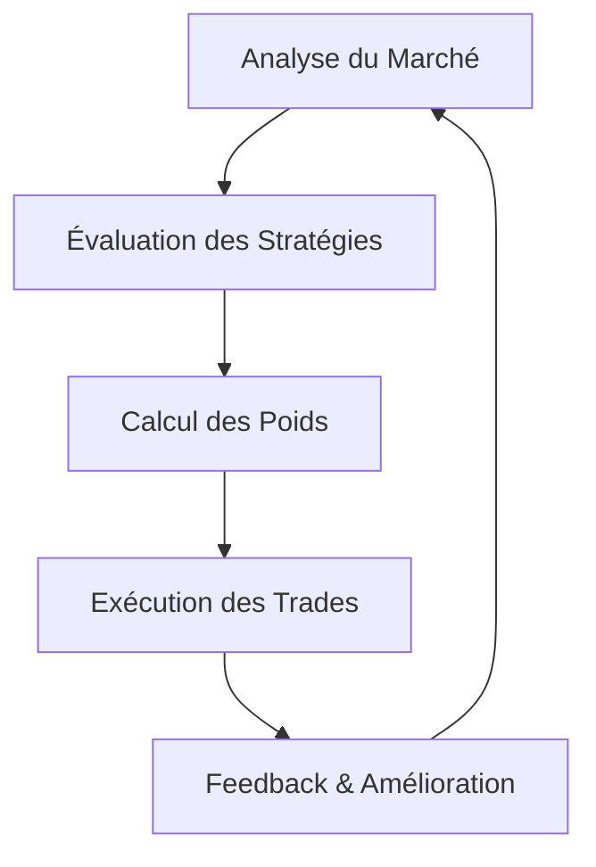

# Méta-Strategie et Sélection Dynamique des Stratégies

## Introduction
La méta-stratégie est un système de niveau supérieur qui sélectionne et pondère dynamiquement les stratégies de trading en fonction des conditions de marché. Ce document explique comment ce système fonctionne et comment il s'intègre dans l'architecture globale du bot de trading.

## Architecture de la Méta-Strategie

### Vue d'Ensemble


### Composants Clés
1. **Analyse du Marché** : Évaluation des conditions actuelles (tendance, volatilité, etc.)
2. **Banque de Stratégies** : Ensemble des stratégies disponibles
3. **Modèle de Score** : Évaluation des performances potentielles
4. **Allocation de Capital** : Répartition du capital entre les stratégies
5. **Boucle de Feedback** : Apprentissage continu à partir des résultats

## Implémentation Technique

### Configuration de la Méta-Strategie
```python
class MetaStrategyConfig:
    def __init__(self):
        # Paramètres d'évaluation
        self.lookback_period = 90  # jours
        self.rebalance_freq = '1d'  # Fréquence de rééquilibrage
        self.min_strategy_weight = 0.05  # Poids minimum par stratégie
        self.max_strategy_weight = 0.5   # Poids maximum par stratégie
        
        # Paramètres de risque
        self.max_drawdown = 0.2  # Drawdown maximum autorisé
        self.target_volatility = 0.15  # Volatilité cible
        
        # Stratégies disponibles
        self.available_strategies = [
            'momentum', 'mean_reversion', 
            'breakout', 'grid', 'swing'
        ]
```

### Évaluation des Stratégies
```python
def evaluate_strategies(market_conditions: dict, 
                      historical_performance: pd.DataFrame) -> dict:
    """
    Évalue chaque stratégie en fonction des conditions de marché.
    
    Args:
        market_conditions: Dictionnaire des conditions de marché actuelles
        historical_performance: DataFrame des performances historiques
        
    Returns:
        Dictionnaire des scores pour chaque stratégie
    """
    scores = {}
    
    # Facteurs d'évaluation
    factors = {
        'trend_strength': market_conditions['trend_strength'],
        'volatility': market_conditions['volatility'],
        'market_regime': market_conditions['regime'],
        'recent_performance': historical_performance.tail(30).mean(),
        'drawdown': historical_performance['drawdown'].iloc[-1]
    }
    
    # Évaluation de chaque stratégie
    for strategy in config.available_strategies:
        score = 0.0
        
        # Règles spécifiques à chaque stratégie
        if strategy == 'momentum':
            score += factors['trend_strength'] * 0.6
            score += (1 - factors['volatility']) * 0.4
            
        elif strategy == 'mean_reversion':
            score += (1 - factors['trend_strength']) * 0.7
            score += factors['volatility'] * 0.3
            
        # Pondération par les performances récentes
        if strategy in factors['recent_performance']:
            score *= (1 + factors['recent_performance'][strategy])
            
        # Pénalité pour drawdown élevé
        if strategy in factors['drawdown']:
            score *= (1 - min(factors['drawdown'][strategy], 0.5))
            
        scores[strategy] = max(0, score)
    
    # Normalisation des scores
    total_score = sum(scores.values())
    if total_score > 0:
        scores = {k: v/total_score for k, v in scores.items()}
    
    return scores
```

### Allocation de Capital
```python
def allocate_capital(scores: dict, 
                   current_weights: dict, 
                   config: MetaStrategyConfig) -> dict:
    """
    Calcule la nouvelle allocation de capital basée sur les scores.
    
    Args:
        scores: Dictionnaire des scores des stratégies
        current_weights: Allocation actuelle du capital
        config: Configuration de la méta-stratégie
        
    Returns:
        Nouvelle allocation de capital
    """
    # Application des contraintes de poids
    new_weights = {}
    remaining_weight = 1.0
    
    # Tri des stratégies par score décroissant
    sorted_strategies = sorted(scores.items(), key=lambda x: x[1], reverse=True)
    
    for strategy, score in sorted_strategies:
        # Calcul du poids cible
        target_weight = score
        
        # Application des contraintes de poids
        target_weight = max(
            config.min_strategy_weight,
            min(target_weight, config.max_strategy_weight)
        )
        
        # Ajustement pour ne pas dépasser le poids restant
        target_weight = min(target_weight, remaining_weight)
        
        if target_weight > 0 and remaining_weight > 0:
            new_weights[strategy] = target_weight
            remaining_weight -= target_weight
    
    # Normalisation finale
    total_weight = sum(new_weights.values())
    if total_weight > 0:
        new_weights = {k: v/total_weight for k, v in new_weights.items()}
    
    return new_weights
```

## Intégration avec le Système de Trading

### Gestionnaire de Méta-Strategie
```python
class MetaStrategyManager:
    def __init__(self, config: MetaStrategyConfig):
        self.config = config
        self.strategies = self._initialize_strategies()
        self.weights = self._initialize_weights()
        self.market_analyzer = MarketAnalyzer()
        self.performance_tracker = PerformanceTracker()
    
    def _initialize_strategies(self) -> dict:
        """Initialise les instances des stratégies."""
        strategies = {}
        for strategy_name in self.config.available_strategies:
            if strategy_name == 'momentum':
                strategies[strategy_name] = MomentumStrategy()
            elif strategy_name == 'mean_reversion':
                strategies[strategy_name] = MeanReversionStrategy()
            # Initialisation des autres stratégies...
        return strategies
    
    async def rebalance(self, market_data: dict) -> dict:
        """
        Rééquilibre l'allocation entre les stratégies.
        
        Args:
            market_data: Données de marché actuelles
            
        Returns:
            Nouvelle allocation des stratégies
        """
        # Analyse des conditions de marché
        market_conditions = self.market_analyzer.analyze(market_data)
        
        # Récupération des performances historiques
        performance = self.performance_tracker.get_performance(
            days=self.config.lookback_period
        )
        
        # Évaluation des stratégies
        strategy_scores = evaluate_strategies(
            market_conditions,
            performance
        )
        
        # Calcul de la nouvelle allocation
        new_weights = allocate_capital(
            strategy_scores,
            self.weights,
            self.config
        )
        
        # Mise à jour des poids
        self.weights = new_weights
        
        return new_weights
    
    async def generate_signals(self, market_data: dict) -> List[dict]:
        """
        Génère des signaux à partir de toutes les stratégies actives.
        
        Args:
            market_data: Données de marché actuelles
            
        Returns:
            Liste des signaux générés
        """
        signals = []
        
        for strategy_name, strategy in self.strategies.items():
            if strategy_name in self.weights and self.weights[strategy_name] > 0:
                try:
                    # Génération des signaux pour chaque stratégie
                    strategy_signals = await strategy.generate_signals(market_data)
                    
                    # Ajout du poids de la stratégie aux signaux
                    for signal in strategy_signals:
                        signal['strategy'] = strategy_name
                        signal['weight'] = self.weights[strategy_name]
                        signals.append(signal)
                        
                except Exception as e:
                    logger.error(f"Error generating signals for {strategy_name}: {str(e)}")
        
        return signals
```

## Exemple d'Utilisation

### Configuration et Lancement
```python
# Configuration de la méta-stratégie
config = MetaStrategyConfig()
config.available_strategies = ['momentum', 'mean_reversion', 'breakout']
config.rebalance_freq = '4h'  # Rééquilibrage toutes les 4 heures

# Initialisation du gestionnaire
meta_strategy = MetaStrategyManager(config)

# Boucle de trading principale
async def trading_loop():
    while True:
        # Récupération des données de marché
        market_data = await get_market_data()
        
        # Rééquilibrage périodique
        if is_time_to_rebalance():
            new_weights = await meta_strategy.rebalance(market_data)
            logger.info(f"Nouvelle allocation: {new_weights}")
        
        # Génération des signaux
        signals = await meta_strategy.generate_signals(market_data)
        
        # Exécution des trades
        await execute_trades(signals)
        
        # Attente jusqu'à la prochaine itération
        await asyncio.sleep(60)  # Toutes les minutes
```

## Bonnes Pratiques

1. **Diversification** : Maintenir une diversité de stratégies non corrélées
2. **Surveillance Continue** : Surveiller les performances et ajuster les paramètres si nécessaire
3. **Backtesting** : Tester rigoureusement la méta-stratégie sur des données historiques
4. **Gestion du Risque** : Implémenter des mécanismes de protection (drawdown max, etc.)
5. **Documentation** : Maintenir une documentation à jour des stratégies et de leurs paramètres

## Conclusion
La méta-stratégie et la sélection dynamique des stratégies permettent d'adapter automatiquement le système de trading aux conditions changeantes du marché. En combinant plusieurs stratégies et en ajustant dynamiquement leur pondération, il est possible d'améliorer la robustesse et les performances globales du système.
