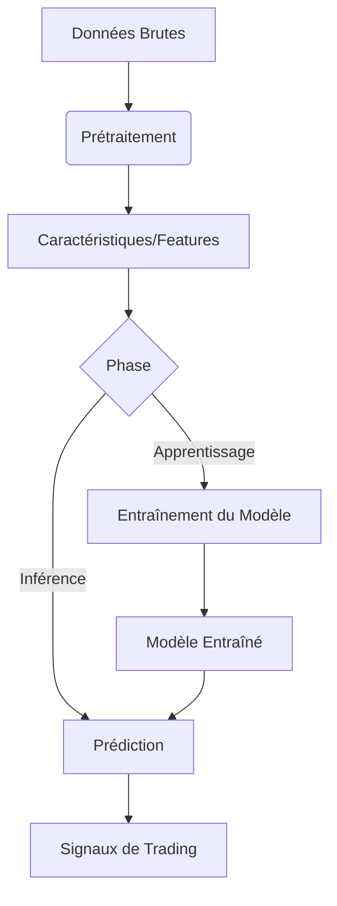

# Intégration du Machine Learning et Automatisation du Backtesting

## Introduction
L'intégration du Machine Learning (ML) dans le système de trading permet d'améliorer la précision des prédictions et d'automatiser le processus de backtesting. Ce document explique comment le ML est intégré dans le système et comment automatiser les tests de stratégies.

## Architecture d'Intégration du ML

### 1. Flux de Données


### 2. Composants Principaux
- **Feature Engineering** : Extraction et sélection des caractéristiques
- **Modèles** : Réseaux de neurones, forêts aléatoires, etc.
- **Backtesting** : Validation des stratégies ML
- **Déploiement** : Mise en production des modèles

## Implémentation du ML

### Configuration du Modèle
```python
class MLModelConfig:
    def __init__(self):
        self.model_type = 'LSTM'  # ou 'RandomForest', 'XGBoost', etc.
        self.features = [
            'returns', 'volatility', 'rsi', 'macd', 
            'orderbook_imbalance', 'liquidity'
        ]
        self.target = 'future_return'
        self.lookback = 60  # périodes de lookback
        self.train_test_split = 0.8
        self.epochs = 100
        self.batch_size = 32
        self.early_stopping = True
        self.patience = 10
```

### Entraînement du Modèle
```python
class MLModel:
    def __init__(self, config):
        self.config = config
        self.model = self._build_model()
        self.scaler = StandardScaler()
    
    def _build_model(self):
        if self.config.model_type == 'LSTM':
            return self._build_lstm()
        elif self.config.model_type == 'RandomForest':
            return RandomForestClassifier()
        # Autres types de modèles...
    
    def _build_lstm(self):
        model = Sequential([
            LSTM(50, return_sequences=True, input_shape=(self.config.lookback, len(self.config.features))),
            Dropout(0.2),
            LSTM(50, return_sequences=False),
            Dropout(0.2),
            Dense(25, activation='relu'),
            Dense(1, activation='tanh')  # Sortie entre -1 et 1
        ])
        
        model.compile(optimizer='adam', loss='mse')
        return model
    
    def train(self, X, y):
        # Prétraitement
        X_scaled = self.scaler.fit_transform(X)
        
        # Préparation des séquences pour LSTM
        if self.config.model_type == 'LSTM':
            X_seq = self._create_sequences(X_scaled, self.config.lookback)
            y_seq = y[self.config.lookback:]
        else:
            X_seq, y_seq = X_scaled, y
        
        # Entraînement
        callbacks = []
        if self.config.early_stopping:
            callbacks.append(EarlyStopping(
                monitor='val_loss',
                patience=self.config.patience,
                restore_best_weights=True
            ))
        
        self.history = self.model.fit(
            X_seq, y_seq,
            epochs=self.config.epochs,
            batch_size=self.config.batch_size,
            validation_split=0.2,
            callbacks=callbacks,
            verbose=1
        )
        
        return self.history
```

## Automatisation du Backtesting

### Configuration du Backtest
```python
class BacktestConfig:
    def __init__(self):
        self.initial_balance = 10000.0
        self.commission = 0.001  # 0.1%
        self.slippage = 0.0005   # 0.05%
        self.risk_free_rate = 0.0
        self.max_drawdown = 0.2  # 20%
        self.position_sizing = 'kelly'  # ou 'fixed', 'volatility'
        self.rebalance_freq = '1d'      # Fréquence de rééquilibrage
```

### Moteur de Backtest
```python
class BacktestEngine:
    def __init__(self, strategy, data, config):
        self.strategy = strategy
        self.data = data
        self.config = config
        self.results = None
    
    def run(self):
        portfolio = {
            'cash': self.config.initial_balance,
            'positions': {},
            'value': self.config.initial_balance,
            'history': []
        }
        
        # Boucle principale du backtest
        for i, (timestamp, row) in enumerate(self.data.iterrows()):
            # Mise à jour de la valeur du portefeuille
            self._update_portfolio_value(portfolio, row)
            
            # Génération des signaux
            signals = self.strategy.generate_signals(row)
            
            # Exécution des ordres
            self._execute_orders(portfolio, signals, row)
            
            # Journalisation
            self._log_portfolio(portfolio, timestamp)
            
            # Vérification des conditions d'arrêt
            if self._should_stop(portfolio):
                break
        
        # Calcul des métriques de performance
        self.results = self._calculate_metrics(portfolio)
        return self.results
    
    def _update_portfolio_value(self, portfolio, market_data):
        # Mise à jour de la valeur des positions
        pass
    
    def _execute_orders(self, portfolio, signals, market_data):
        # Logique d'exécution des ordres
        pass
    
    def _log_portfolio(self, portfolio, timestamp):
        # Journalisation de l'état du portefeuille
        pass
    
    def _should_stop(self, portfolio):
        # Vérification des conditions d'arrêt (drawdown max, etc.)
        return False
    
    def _calculate_metrics(self, portfolio):
        # Calcul des métriques de performance (Sharpe, Sortino, etc.)
        return {}
```

## Intégration avec le Système de Trading

### Pipeline d'Apprentissage Automatique
```python
class MLPipeline:
    def __init__(self, config):
        self.config = config
        self.feature_engineer = FeatureEngineer()
        self.model = MLModel(config.model_config)
        self.backtester = BacktestEngine(
            strategy=MLStrategy(self.model),
            data=None,  # Données à fournir
            config=config.backtest_config
        )
    
    def run(self, data):
        # 1. Ingénierie des caractéristiques
        features = self.feature_engineer.transform(data)
        
        # 2. Entraînement du modèle
        X, y = self._prepare_data(features)
        self.model.train(X, y)
        
        # 3. Backtest
        results = self.backtester.run()
        
        # 4. Évaluation des performances
        metrics = self._evaluate_performance(results)
        
        return {
            'model': self.model,
            'backtest_results': results,
            'performance_metrics': metrics
        }
    
    def _prepare_data(self, data):
        # Préparation des données pour l'entraînement
        pass
    
    def _evaluate_performance(self, results):
        # Calcul des métriques de performance
        pass
```

## Bonnes Pratiques

1. **Validation Croisée** : Utiliser la validation croisée pour évaluer la robustesse des modèles
2. **Feature Importance** : Analyser l'importance des caractéristiques
3. **Forward Testing** : Tester les modèles sur des données hors échantillon
4. **Monitoring** : Surveiller les performances en temps réel
5. **Versioning** : Versionner les modèles et les données

## Exemple de Workflow Complet

```python
# Configuration
config = {
    'model': {
        'model_type': 'LSTM',
        'features': ['returns', 'volatility', 'rsi', 'macd'],
        'lookback': 60,
        'epochs': 100,
        'batch_size': 32
    },
    'backtest': {
        'initial_balance': 10000,
        'commission': 0.001,
        'slippage': 0.0005
    }
}

# Chargement des données
data = load_historical_data('BTC/USD', '1d', '2020-01-01', '2023-01-01')

# Création et exécution du pipeline
pipeline = MLPipeline(config)
results = pipeline.run(data)

# Visualisation des résultats
plot_performance(results['backtest_results'])
```

## Conclusion
L'intégration du Machine Learning et l'automatisation du backtesting permettent de développer des stratégies de trading plus sophistiquées et robustes. En suivant les bonnes pratiques et en validant rigoureusement les modèles, il est possible d'améliorer significativement les performances du système de trading.
