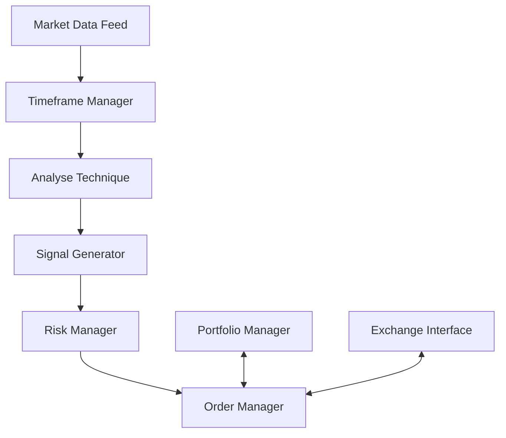

# Stratégies Multi-Marchés et Multi-Timeframes

## Table des matières
1. [Introduction](#introduction)
2. [Architecture du Système](#architecture-du-système)
3. [Configuration des Marchés](#configuration-des-marchés)
4. [Gestion des Timeframes Multiples](#gestion-des-timeframes-multiples)
5. [Exemples de Stratégies](#exemples-de-stratégies)
6. [Bonnes Pratiques](#bonnes-pratiques)
7. [Dépannage](#dépannage)

## Introduction

Les stratégies multi-marchés et multi-timeframes permettent d'exploiter les opportunités sur différentes échelles de temps et paires de trading simultanément. Ce document explique comment configurer et optimiser ces stratégies avancées.

## Architecture du Système



## Configuration des Marchés

### Fichier de Configuration

```yaml
# config/markets.yaml
markets:
  - pair: BTC/USD
    base: BTC
    quote: USD
    min_order: 0.001
    precision: 1
    enabled: true
    
  - pair: ETH/USD
    base: ETH
    quote: USD
    min_order: 0.01
    precision: 2
    enabled: true
```

### Sélection Dynamique des Marchés

```python
class MarketSelector:
    def __init__(self, config):
        self.config = config
        self.volatility_cache = {}
        
    def select_markets(self, volatility_threshold=0.02):
        """Sélectionne les marchés selon la volatilité récente"""
        selected = []
        for market in self.config['markets']:
            if not market['enabled']:
                continue
                
            volatility = self.calculate_volatility(market['pair'])
            if volatility >= volatility_threshold:
                selected.append({
                    'pair': market['pair'],
                    'volatility': volatility,
                    'base': market['base'],
                    'quote': market['quote']
                })
        return sorted(selected, key=lambda x: x['volatility'], reverse=True)
```

## Gestion des Timeframes Multiples

### Hiérarchie des Timeframes

```python
TIMEFRAMES = {
    '1m': 60,
    '5m': 300,
    '15m': 900,
    '1h': 3600,
    '4h': 14400,
    '1d': 86400
}
```

### Synchronisation des Données

```python
class TimeframeManager:
    def __init__(self, timeframes):
        self.timeframes = timeframes
        self.data = {tf: {} for tf in timeframes}
        
    async def update(self, pair, timestamp, price, volume):
        """Met à jour les données pour tous les timeframes"""
        for tf, tf_sec in self.timeframes.items():
            tf_timestamp = (timestamp // tf_sec) * tf_sec
            
            if tf_timestamp not in self.data[tf]:
                self._initialize_candle(tf, tf_timestamp, price, volume)
            else:
                self._update_candle(tf, tf_timestamp, price, volume)
                
    def get_signals(self, pair):
        """Génère des signaux basés sur l'analyse multi-timeframe"""
        signals = {}
        for tf in self.timeframes:
            signals[tf] = self._analyze_timeframe(pair, tf)
        return self._combine_signals(signals)
```

## Exemples de Stratégies

### 1. Suivi de Tendance Multi-Timeframe

```python
class MultiTimeframeTrendStrategy:
    def __init__(self, config):
        self.fast_ma = config.get('fast_ma', 20)
        self.slow_ma = config.get('slow_ma', 50)
        self.timeframes = ['15m', '1h', '4h']
        
    def analyze(self, data):
        signals = {}
        for tf in self.timeframes:
            df = data[tf]
            df['fast_ma'] = df['close'].rolling(self.fast_ma).mean()
            df['slow_ma'] = df['close'].rolling(self.slow_ma).mean()
            signals[tf] = 'BUY' if df['fast_ma'].iloc[-1] > df['slow_ma'].iloc[-1] else 'SELL'
        return self._combine_signals(signals)
    
    def _combine_signals(self, signals):
        # Logique de combinaison des signaux
        if all(signal == 'BUY' for signal in signals.values()):
            return 'STRONG_BUY'
        elif all(signal == 'SELL' for signal in signals.values()):
            return 'STRONG_SELL'
        return 'NEUTRAL'
```

### 2. Mean Reversion Multi-Marché

```python
class MultiMarketMeanReversion:
    def __init__(self, config):
        self.zscore_window = config.get('zscore_window', 20)
        self.entry_z = config.get('entry_z', 2.0)
        self.exit_z = config.get('exit_z', 0.5)
        
    def analyze(self, market_data):
        signals = {}
        for pair, data in market_data.items():
            df = data['1h']  # Utilise le timeframe 1h
            df['returns'] = df['close'].pct_change()
            df['zscore'] = (df['returns'] - df['returns'].rolling(
                self.zscore_window).mean()) / df['returns'].rolling(self.zscore_window).std()
                
            if df['zscore'].iloc[-1] > self.entry_z:
                signals[pair] = 'SELL'
            elif df['zscore'].iloc[-1] < -self.entry_z:
                signals[pair] = 'BUY'
            elif abs(df['zscore'].iloc[-1]) < self.exit_z:
                signals[pair] = 'CLOSE'
                
        return signals
```

## Bonnes Pratiques

1. **Gestion du Capital**
   - Allouer un pourcentage du capital par marché
   - Ajuster la taille des positions en fonction de la volatilité
   - Limiter l'exposition totale du portefeuille

2. **Optimisation des Performances**
   - Utiliser le cache pour les indicateurs techniques
   - Traiter les données par lots pour réduire la charge CPU
   - Désactiver les calculs inutiles

3. **Gestion des Risques**
   - Définir des stops dynamiques basés sur l'ATR
   - Limiter le nombre de positions simultanées
   - Surveiller les corrélations entre marchés

## Dépannage

### Problèmes Courants

1. **Latence Élevée**
   - Vérifier les connexions réseau
   - Optimiser les requêtes API
   - Réduire le nombre de timeframes analysés

2. **Signaux Contradictoires**
   - Vérifier la synchronisation des données
   - Ajuster les paramètres des indicateurs
   - Revoir la logique de combinaison des signaux

3. **Problèmes de Performance**
   - Activer le cache des indicateurs
   - Réduire la fréquence des mises à jour
   - Utiliser des agrégations plus efficaces

### Surveillance

```yaml
# config/monitoring.yaml
metrics:
  latency:
    warning: 100  # ms
    critical: 500
    
  memory:
    warning: 80%  # Utilisation mémoire
    critical: 90%
    
  signals:
    check_interval: 300  # secondes
    max_inactive: 3600   # secondes avant alerte
```

## Conclusion

Les stratégies multi-marchés et multi-timeframes offrent une approche puissante pour le trading algorithmique, mais nécessitent une gestion minutieuse des ressources et des risques. En suivant les bonnes pratiques décrites dans ce document, vous pourrez tirer parti de ces stratégies tout en maintenant des performances optimales.
